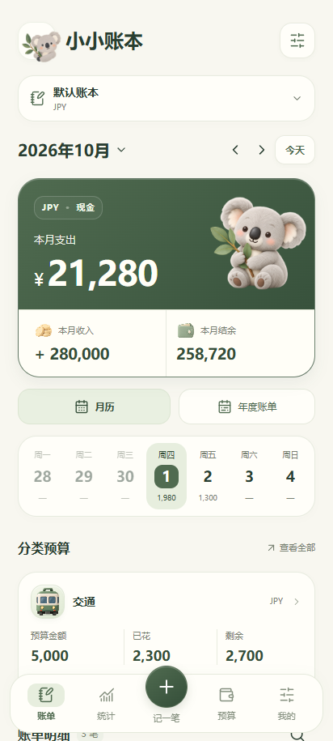
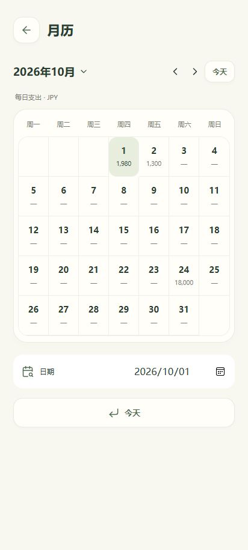
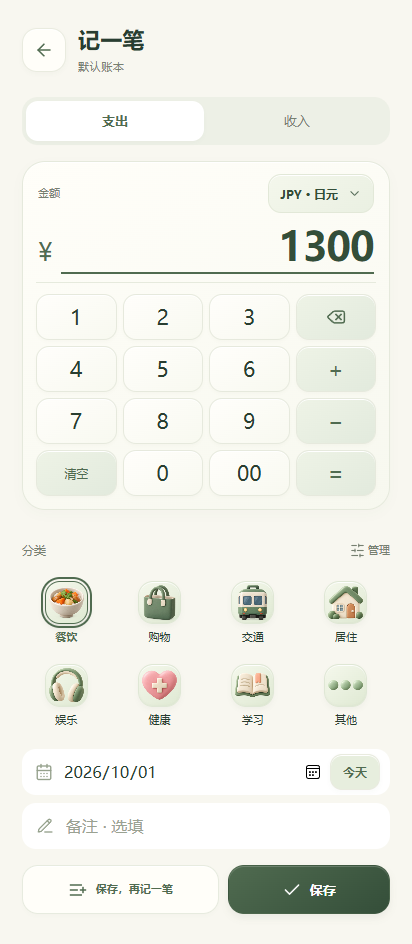
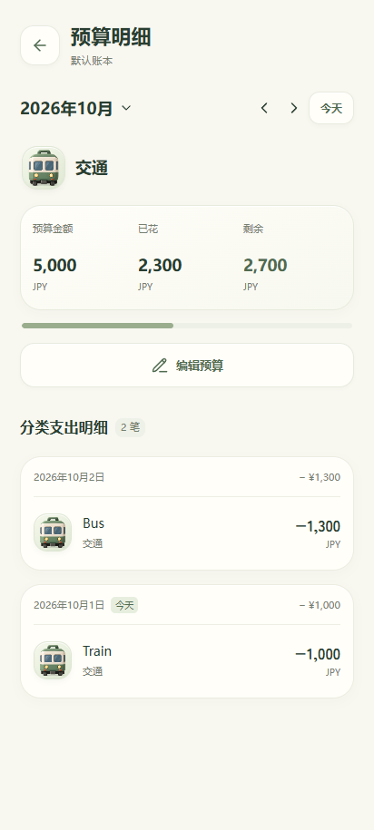

# 小小账本 0.5.2 验证结果

2026-10-01。按用户选定的 A 首页方案优化布局，以按钮打开 B 方向的整月日历；同时完成记账区域、每日花费和预算明细改进。财务核心、原生存储、原生校验及数据格式5保持不变。

## 本轮完成

- 首页保留大小考拉、账本选择、本月收支和快速点日期，以清楚的纸面卡片安排周日期、分类预算与当天明细；「月历」打开整月日期和每日支出，年度入口继续保留。
- 金额输入和数字键盘放在同一张相邻卡片内，保留币种选择、加减运算、连续保存、分类、日期与备注。
- 整月日历按当前账本主币展示每天支出，无支出显示「—」。收入排除，未来账目正常计入；长金额简写并保留精确辅助标签，点日期看完整明细，支持月切换和今天。
- 分类预算显示额度、已花、剩余和对应支出。交通预算¥5,000，两笔¥1,000和¥1,300时已花¥2,300、剩余¥2,700；可切月份、编辑额度、查看或修改/删除账目，保存后返回原预算月份。超支和未设置预算状态也保留。
- 多账本隔离、原币金额与固定汇率历史、四语言、选择面板、短动画和禁止边缘拉伸继续保留。
- 专项检查修复币种选择中HK$和NT$过大贴边的问题，仅这两个多字符符号使用较小字号；其余符号和全部25分类插画继续居中。

## 本轮运行的检查

| 检查 | 通过数量 | 主要范围 |
|---|---:|---|
| 随源码浏览器测试 | 51 | 原22反馈测试与新增功能测试，金额输入、月历、预算、固定换算历史、回滚、四语言窄屏 |
| 既有交互与主币回归 | 21 | 日期、考拉、主币转换、预算历史、保存失败与取消；预算编辑路径适配新详情入口 |
| 多账本及英语回归 | 16 | 迁移、隔离、英语重开、异步报价、备份恢复撤销、选择面板 |
| 外币流程回归 | 16 | 手动及缓存报价、历史汇率、原币与换算金额、日期、取消与迟到结果 |
| Java 单元测试 | 57 | 原生集合、财务校验、换币与汇率边界 |

共 **161 项功能及回归检查通过**，失败0项。另有 **168 个实际页面布局检查**，覆盖四语言、JPY/CNY/KRW、320/360/412宽度与320×480短屏，金额与键盘相邻、日历金额和预算三数无横向溢出，保存按钮可通过正常滚动到达。首页更新后另做小额、长金额、考拉关闭及减少动画的截图检查。专门的对齐、裁切和语言扫描覆盖四语言、320/412宽的184个页面状态，包括首页、日历、年度、统计、预算、账目、账本管理、分类管理和选择面板；四语言分类编辑与语言选择中的语言标签属于合法的多语言输入/选择。

英语覆盖为272个所需键、315个翻译键，无缺失、空值或混杂系统文案。

`assembleDebug`、`lintDebug`、`testDebugUnitTest` 成功。Lint结果：0 errors, 6 warnings。本机Platform-Tools未安装提示未阻止这些构建任务完成。没有重新运行0.5.0全部207项及375个跨语言一致性案例，不能把旧版数量算进本轮结果。

`npm test` 运行 `tests/ui-feedback.test.cjs` 与 `tests/ui-feature-improvements.test.cjs`，依赖安装见README。本机通过环境变量使用已安装的Playwright与Edge运行同一份脚本；其他既有工作区回归脚本没有随源码打包。

## 安装包与资源

- 包名：`com.koalaledger.app`
- 版本：`0.5.2`，版本代码`7`；最低Android8.0/API26，目标API35
- 权限仅`android.permission.INTERNET`，用于原生货币对报价
- 安装包：`little-ledger-0.5.2.apk`；本地中文别名`小小账本-0.5.2-安卓测试版.apk`
- 大小：10,930,512字节
- SHA-256：`e05d643eac6b0a10021b23ac2bf1b6a1234d18935b6e4178ba729bdbdf6a6a96`
- 签名验证通过，与0.5.1及旧测试版一致，可以直接覆盖安装
- 22个打包资源与当前源码逐一匹配SHA-256，包含脚本、样式、字体、插画与许可

源码ZIP和APK校验值见仓库`downloads/SHA256SUMS.txt`。签名私钥、本机SDK路径、构建缓存、认证信息及真实账本不包含在源码或下载包中。

## 实际资源截图与限制

截图和浏览器测试使用本地实际应用资源、资源白名单与CSP，数据为虚构示例，原生接口为模拟。**本轮未在X300 Pro安装或传输。** 手机实际覆盖升级、关闭重开、文件选择和手势体验仍需试用。历史结果见[0.5.1验证记录](验证结果-0.5.1.md)及[0.5.0验证记录](验证结果-0.5.0.md)。
